Boxy Brown
===

_"Uh uh, I ain't hearing that see.  You askin' and you tellin'.  Cause nobody tells Boxy Brown!"_ -- Boxy Brown

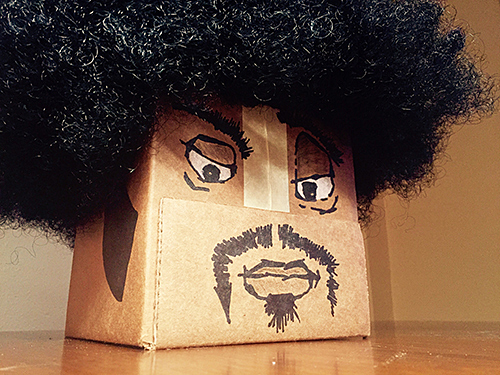

__LEGAL:__ Audio Clips and Images of Boxy Brown are owned and copyrighted by The Cartoon Network and Adult Swim. Commercial use of their property is prohibited by law.

Table of Contents
---

* [WTF is This?](#wtf-is-this)
* [Part List](#part-list)
* [Wiring Instructions](#wiring-instructions)
* [Hardware Assembly](#hardware-assembly)
* [Software Installation](#software-installation)
* [Triggering Voices](#triggering-voices)
* [Reference Material](#reference-material)

WTF is This?
---

**[⇧ back to top](#table-of-contents)**

If you have ever seen Adult Swim's [Aqua Teen Hunger Force](http://www.adultswim.com/videos/aqua-teen-hunger-force/), this project is to make a real life version of my personal favorite character, [Boxy Brown](http://aqua-teen-hunger-force.wikia.com/wiki/Boxy_Brown) that plays actual audio clips from the show.  I am working on getting a Mobile App added to this project to remote trigger audio clips, but am releasing this in the mean time since it works.

__DEMO VIDEO__: [https://vimeo.com/159305190](https://vimeo.com/159305190)

Part List
---

**[⇧ back to top](#table-of-contents)**

#### You will need to purchase the following hardware:

* `ARD` [Arduino Uno R3](https://www.adafruit.com/products/50?utm_medium=referral&utm_source=manifestinteractive) _$24.95_
* `MP3` [Adafruit "Music Maker" MP3 Shield ( with amp )](https://www.adafruit.com/products/1790?utm_medium=referral&utm_source=manifestinteractive) _$29.95_
* `BLU` [Bluetooth Low Energy (BLE 4.0) - nRF8001](https://www.adafruit.com/product/1697?utm_medium=referral&utm_source=manifestinteractive) _$19.95_
* `SPK` [Speaker - 3" Diameter - 4 Ohm 3 Watt](https://www.adafruit.com/products/1314?utm_medium=referral&utm_source=manifestinteractive) _$1.95_

#### Other stuff you'll need:

* [Micro SD Card ( 2GB )](http://www.amazon.com/Sandisk-2GB-Micro-Sd-Card/dp/B000N3LL02) _$7.95_
* [6"x6"x6" Cardboard Box](http://www.amazon.com/gp/product/B00E81KHOG) _$7.50_
* [Arduino Power Supply](http://www.amazon.com/gp/product/B00F4UURCM) _$5.99_
* [Black Afro Wig](http://www.amazon.com/gp/product/B00437IGZ2) _$8.99_
* [Double Sided Foam Tape Squares](http://www.amazon.com/3M-Scotch-Mounting-Squares/dp/B002YM3VYY) _$5.33_
* [Sharpie Chisel Tip Permanent Marker](http://www.amazon.com/Sharpie-Chisel-Tip-Permanent-Markers/dp/B000XF2TOM) _$4.81_

You may also want a White & Brown Colored Pencil if you are a perfectionist like me and wish to add some color to Boxy Brown's lips & eyes.  You will also want some yellow/white-ish colored tape ( like scotch tape, or whatever you have lying around ).

Wiring Instructions
---

**[⇧ back to top](#table-of-contents)**

Since the `MP3` shield will be placed directly on top of the `ARD` Arduino, you will need to hook everything up using the following method:

| Part | Pin    | > | Part | Pin  | Cable  |
|------|--------|---|------|------|--------|
| BLU  | SCK    | > | MP3  | 13   | Blue   |
| BLU  | MISO   | > | MP3  | 12   | Yellow |
| BLU  | MOSI   | > | MP3  | 11   | Orange |
| BLU  | REQ    | > | MP3  | 10   | Grey   |
| BLU  | RDY    | > | MP3  | 2    | White  |
| BLU  | RST    | > | MP3  | 9    | Orange |
| BLU  | GND    | > | MP3  | GND  | Black  |
| BLU  | VIN    | > | MP3  | VCC  | Red    |

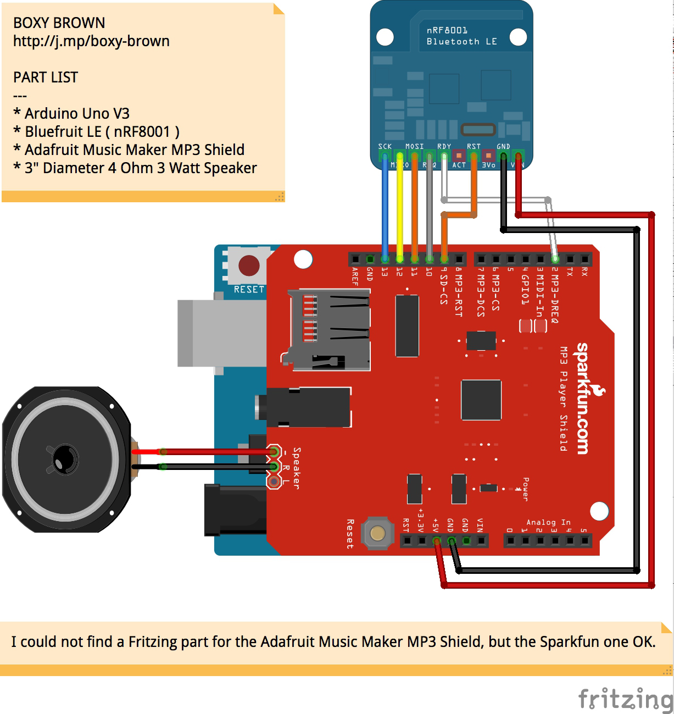

Hardware Assembly
---

**[⇧ back to top](#table-of-contents)**

### Step 1:

Here we have all the hardware ready to be assembled.  I have attached some short bits of wire to the Bluetooth Module in preperation for the next steps.

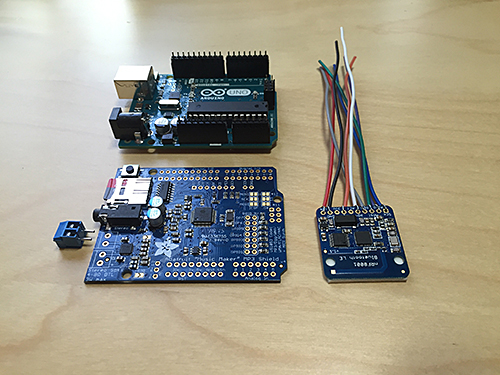

### Step 2:

Place Double Sided Foam Tape on the back of the Bluetooth Module.

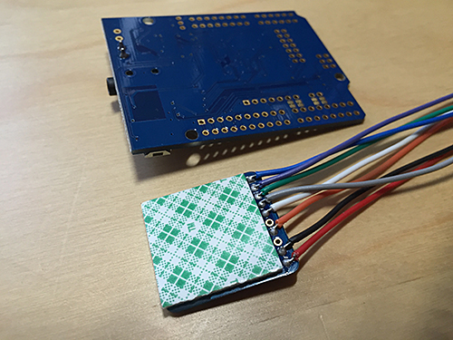

### Step 3:

Place Bluetooth Module in the exact location shown below ( only do this if you have already soldered the wires to the Bluetooth Module ).  The reason for this specific location is that this will be underneath the MP3 Shield when you stack it on top of the Arduino.  This specific placement does not obscure or make contact with anything on the Arduino Uno.  While you have the MP3 Shield flipped over on its back side, you should go ahead and solder the LEFT speaker connector to the amp on the MP3 Shield.  DO NOT attach the RIGHT one, as that will actually block your ability to mount the MP3 Shield to the Arduino Board.  Since the audio files are Mono, you only need one speaker to play the audio files.

See the [Bluetooth LE Assembly Documentation](https://learn.adafruit.com/getting-started-with-the-nrf8001-bluefruit-le-breakout) if you need further assistance.

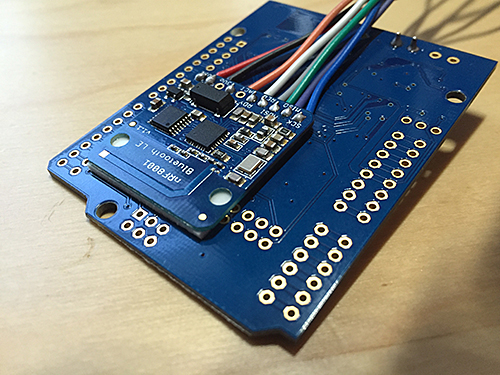

### Step 4:

Using the [Wiring Instructions](#wiring-instructions), wire the Bluetooth Module into the correct holes on the MP3 Shield.  You do not need to solder anything just yet, as it will be easier to do this one you place the MP3 Shield on top of the Ardiono Uno.  Once this is done, you can attach the MP3 Shield to the Arduino Uno and solder all the pins needed to make the connections.

See the [MP3 Shield Assembly Documentation](https://learn.adafruit.com/adafruit-music-maker-shield-vs1053-mp3-wav-wave-ogg-vorbis-player) if you need further assistance.

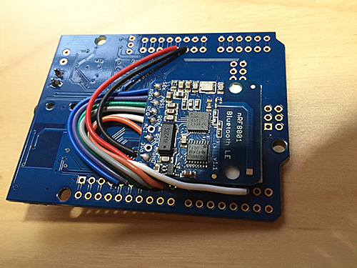

### Step 5:

In order to mount the hardware inside Boxy Brown, we need to attach some Double Sided Foam Tape to the Back of the Arduino Uno and the Top of the Speaker. For the Arduino Uno, you will need to use two layers of Foam Tape since only one layer actually rest below the existing pins that are poking out of the board.  Adding a second layer of foam tape clears those pins so you can actually stick it to something.

 Likewise, for the Speaker, you will want to do two layers of tape, but this to prevent speaker damage.

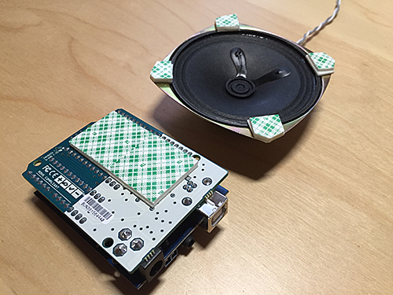

### Step 6:

Here you can see that the Speaker has an air gap by using two layers of Double Sided Foam Tape.  This both allows for higher output as the audio will be able to escape the speaker, as well as prevent damage to the speaker allowing it to flow without restriction.

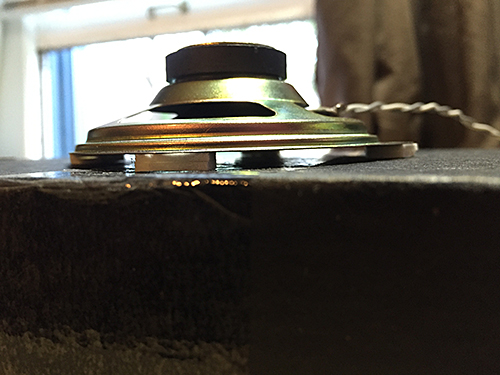

### Step 7:

I placed the Speaker directly behind Boxy Browns mouth.  I attached the Arduino Uno to the inside as well.  Keep in mind that you will want to be able to access the USB and Micro SD card so leave yourself room to insert / remove these from your installation so you can make updates if you choose.

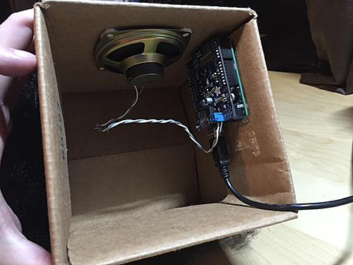

Software Installation
---

**[⇧ back to top](#table-of-contents)**

Before you install the software onto your Arduino Uno, you will want to copy all the audio files in the [./sounds](sounds) folder into the root of your Micro SD Card, then insert the SD Card into the MP3 Shield.  Do not change the file names as the software expects them to be named exactly as they are.  Also, make sure not to put the files in any folders on the SD card.  They should be directly in the root of the card.

Once you have all the hardware installed, you just need to open the [./sketch/sketch.ino](sketch/sketch.ino) file in your [Arduino Code Editor](https://www.arduino.cc/en/Main/Software).  Now you just need to upload the sketch to your Arduino Uno.

Triggering Voices
---

**[⇧ back to top](#table-of-contents)**

You can trigger Boxy Brown to speak from within the Ardiono Editor via `Tools > Serial Monitor`.  Once you have the Serial Monitor Open, make sure you have the following properly set:

* [x] Autoscroll
* No Line Ending
* 9600 baud

With everything setup, you can now send commands to the Ardiono.  Simply type in the command, and press return ( or press the Send button ).

### Here is the current command list:

| Command | File         | Description                               |
|---------|--------------|-------------------------------------------|
| +       | N/A          | Increases Volume                          |
| -       | N/A          | Decreases Volume                          |
| 1       | boxy_001.mp3 | Plays __"Nobody tells Boxy Brown"__ Clip  |
| 2       | boxy_002.mp3 | Plays __"That was a grocery bag"__ Clip   |
| 3       | boxy_003.mp3 | Plays __"I just a what, b&@#$ ?!?!"__ Clip |
| 4       | boxy_004.mp3 | Plays __"Diss me to my face"__ Clip       |
| 5       | boxy_005.mp3 | Plays __"I want me some pie"__ Clip       |

You are probably wondering why I have a Bluetooth Module if I am not using it.  This is a great question, and it shows you are paying attention.  Boxy Brown would be impressed.  I am working on a Mobile App ( that I will also release as part of this project ) to allow remote triggering of these commands from your favorite Android or iOS device :)

Reference Material
---

**[⇧ back to top](#table-of-contents)**

Since you will need to draw Boxy Brown yourself ( or have a talented friend do it ), here are some reference images.

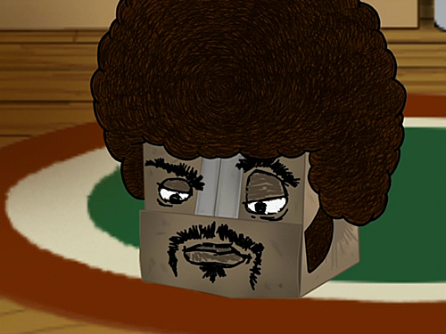

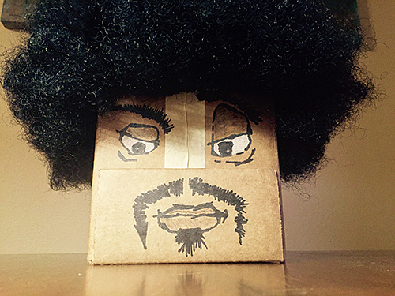
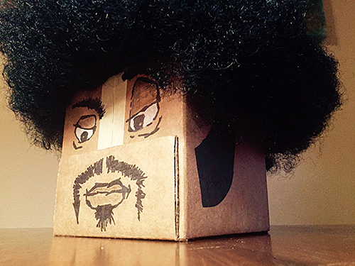
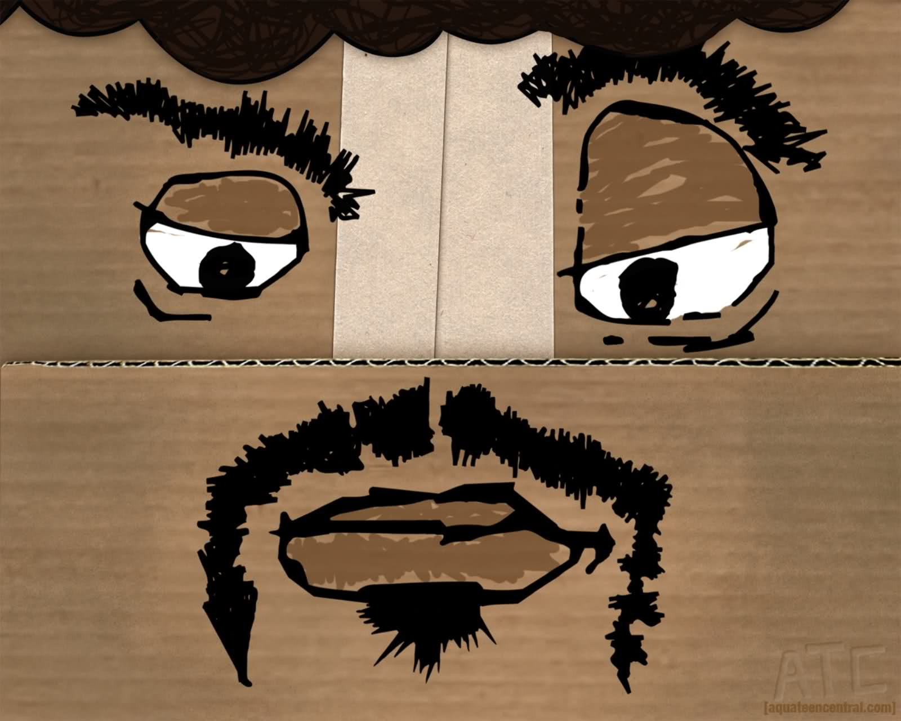
